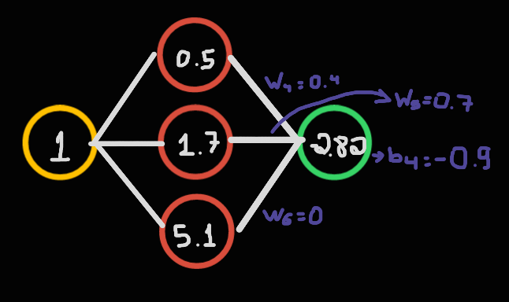

# Uma rede neural para aproximar a função seno sem uso de bibliotecas externas
Esse projeto faz parte da pesquisa da Iniciação Científica do LIPAI-Iniciação Científica e Trabalho de Conclusão ofertada na UFU. Aqui vou buscar criar e explicar a criação e lógica de uma rede neural simples, o objetivo é não usar bibliotecas que simplifiquem demais e abstraiam do programador o funcionamento real das redes neurais como PyTorch e TensorFlow.
Serão usadas bibliotecas de cálculos como a NumPy para calculos de multiplicações de matrizes e senos, bibliotecas como matplotlib serão usadas para criação de gráfcos que vão auxiliar no entendimento dos processos.

## Lógica geral
Antes de tudo a rede neural é uma função que recebe um apanhado de entradas e gera outro de saída. No exemplo desse notebook a função seno recebe uma entrada x e uma saída y, assim será a rede neural, receberá um valor e deverá responder com outro que, esperamos, seja o mais próximo possível da resposta correta.

### Neurônios
São as mínimas partes fundamentais de uma rede neural, similarmente ao cerebro humano 
operam logicamente, a junção do trabalho de vários culmina em uma rede neural. É possível
pensar que eles são apenas bolas que gardam pesos. Esse é uma imagem que pode ajudar a visualizar como cada neuronio se conecta com todos da camada anterior:


Os neurônios ficam separados em 3 camadas (ou, do inglês, layers), os de entrada, intermediários (ou escondidos), e os de saída. Os intermediários também podem ser chamados de escondidos, isso porque não são a parte interessante para o usuário da rede;para quem a usa o importante é a camda de entrada, que recebe os dados do usuário e a desaída que responde a informação pronta, a camada intermediária é, para os usuários uma caixa preta.
Redes podem possuir diversos neurônios de entrada( como uma rede que interpreta imagens, cada pixel vai ser representado por um neurônio na camada inicial) ou apenas um, como é o caso dessa rede, ela recebe apenas um valor no eixo das abscisas.
A camada intermediária é quem de fato "aprende" e prediz resultados, por causa disso possui vários neurônios e pode possuir várias camadas dentro de sí. No exemplo daqui camda intermediária tem apenas uma _fileira_ de 20 neurônios.
A camada de saída também pode possuir diverssos neurônios como em um caso em que predizse uma imagem é a letra A ou E ou I ..., se há múltipla escolha pode haver vários na saída. Se a resposta da rede deve ser SIM ou NÃO pode haver apenas um neurônio e seu valor indicar, 0 como falso e 1 como verdadeiro. Aqui há apenas um neurônio, seu valor é a resposta da rede, como a função seno possui imagem no intervalo [-1,1] esses são os valores que o neurônio pode ter.

---

### Ideia geral
É esperado que a rede desse projeto receba um valor, o processe e retorne o seno dessa entrada, mas como isso é possível ? Em resumo, a rede neural inicia com neurônios com pesos aleatórios, a entrada  interage com esses pesos na camada interna e esses valores são somados na camada de saída, esse valor é a resposta que a rede tem a nos oferecer. 
Como na imagem:

A gente pode considerar que o peso do neuronio de cima é W1=0.5 , assim, 1 * 0.5 = 0.5 que éo valor mostrado, o peso do segundo neurônio é W2=0.7 e ele também possui um bias (um valor extra a ser somado) b2=1, assim 1*0.7 + 1 = 1.7, o mesmo para o neuronio de baixo: w3=3.4 e b3=1.7. O neuronio de saída tembém possui pesos e bias. É importante entender que os pesos "estão nas conexões" entre neuronios e o bias é do neuronio, isso é, entre o neuoronio final e cada um dos 3 neuronios intermediários há um peso único, ou seja, 3 pesos, mas o bias é unico para o neuronio final. Uma possibilidade é que a configuração seja:
0.5 * 0.4 - 0.9 = -0.7
1.7 * 0.4 - 0.9 = -1.22
5.1 * 0 - 0.9 = -0.9
O valor do ultimo neuronio vai ser a soma: -2.82


É óbvio que o seno de 1 não é -2.82 então precisamos decidir o quão errada foi essa resposta e achar uma maneira de acertar os pesos e bias para que na próxima tentativa a rede melhore.

---

### Backpropagation
Depois que a rede faz a previsão e calculamos o quão errada ela está (pela Função de Perda que podem ser de vários tipos, mas o objetivo é sempre determinar o quão errada foi a resposta da rede), precisamos ajustar os pesos para que, na próxima tentativa, o erro seja menor. Esse processo de ajuste é o que chamamos de Backpropagation.

O objetivo é minimizar a perda ajustando os pesos da rede. Para isso usamos o **Gradiente Descendente**.
Grdiente Descendente é nada mais é que aplicar derivada nessa Função de Perda, a deivada é  a reta tangente à curva num determinado ponto, essa reta aponta para a direção de maior crescimento da função, se formos na direção oposta entamos indo na direção que o erro é o menos possível. E exatamente isso o que queremos! Se vamos nessa direção, achamos como devemos mexer nos parametros da função para diminuir o erro. Como os paramentros dessa função são o resultado otido pela rede e o resultado real podemos usar isso para determinar como os pesos devem mudar.
Assim podemos encontra a direção que mais rapidamente reduz a função de perda. Imagine a função de perda como um gráfico: a derivada no ponto atual mostra a direção de maior crescimento, então seguimos na direção contrária, onde ela diminui.

A regra geral de ajuste do peso é:
$$
z_j^L = Σ_k (w_jk^L * a_k^(L-1)) + b_j^L
$$

Onde:  
1. `z_j^L` é a **entrada ponderada** do neurônio `j` na camada `L`.  
2. `w_jk^L` é o **peso** que conecta o neurônio `k` da camada `L-1` ao neurônio `j` da camada `L`.  
3. `a_k^(L-1)` é a **ativação** do neurônio `k` da camada anterior.  
4. `b_j^L` é o **bias** do neurônio `j`.

- Essa lógica é válida para todas as camadas exceto a primeira, já que sua ativação é definida diretamente pelo dado de entrada.
- A **ativação** do neurônio é definida apenas depois de passar pela **função de ativação** como sigmoid ou ReLU.
- Passamos a entrada ponderada para a ativação para produzir **não-linearidade**. Quebras de lógica lineares consecutivas conseguem gerar resultados mais complexos do que uma única função linear.

---

### Forward Pass

- A entrada de cada neurônio na camada de input é o valor da entrada; não há ativação, entrada ponderada, pesos nem bias.
- Cada neurônio da próxima camada aplica o cálculo da entrada ponderada e assim sucessivamente, até a última camada de output.

---

### Loss Function

- Após a última camada ter calculado suas ativações, é calculada uma **função de perda** que mede o quão errada foi a previsão.
- Pode ser, por exemplo, o **Erro Quadrático Médio** ou **Cross-Entropy**.
- Chamamos de `L` essa função.

---

### Backpropagation

- O objetivo é minimizar a perda ajustando os pesos.
- Utiliza-se o **Gradiente Descendente** para encontrar a direção que reduz a função de perda.
- É como visualizar essa função de perda em um gráfico e olhar a derivada no ponto que a camada de output nos deu, seguindo na direção negativa, em direção a um mínimo local.
- A regra geral para o ajuste do peso é: 
$$ w_jk^L = w_jk^L - n * (∂L/∂w_jk^L) $$


Onde:  
1. `w_jk^L` é o peso que conecta o neurônio `k` da camada `L-1` ao neurônio `j` da camada `L`.  
2. `n` é a **taxa de aprendizagem**.  
3. `∂L/∂w_jk^L` é a **derivada da perda** em relação ao peso.

- Essa taxa de aprendizagem define o tamanho do passo:  
  - Passos grandes podem acelerar o processo mas podem saltar o mínimo.  
  - Passos pequenos podem exigir milhares de iterações para alcançar um bom resultado.

---

### Como calcular essa derivada?

- Utiliza-se a **Regra da Cadeia** do cálculo diferencial, decompondo a derivada em partes.

$$ ∂L/∂w_jk^L = (∂L/∂a_j^L) * (∂a_j^L/∂z_j^L) * (∂z_j^L/∂w_jk^L) $$


- O que queremos aqui é saber o quanto o peso influencia na função de perda.
- Se a influência for pequena, o "passo" deve ser maior; se for grande, os passos devem ser mais cautelosos.
- O problema é que a função de perda não depende diretamente do peso.
- O caminho é:  
  **Peso → Entrada ponderada → Ativação → Saída da rede → Perda**

---

### Primeiro termo: $$ ∂L/∂a_j^L $$


- Representa o **erro local**, ou seja, o quanto o neurônio `j` da camada `L` influencia na perda.

---

### Segundo termo: $$ ∂z_j^L/∂w_jk^L $$


- É a influência direta do peso `w_jk` na entrada ponderada `z_j`.

- O produto desses dois termos mostra o quanto a ativação do neurônio da camada anterior afeta a perda, mediado pelo erro local.

- Se a ativação `a_k^(L-1)` for alta e o erro local `δ_j^L` também, o peso associado a essa conexão deve ser fortemente ajustado.

---

### Como calcular o delta (`δ`)?

- Seu cálculo é diferente para as camadas **externa** e **internas**.


#### Na camada de saída: $$ δ_j^L = ∂L/∂a_j^L * ∂a_j^L/∂z_j^L $$


- Queremos a derivada da **Função de Perda** em relação à **Entrada Ponderada**.
- Como a perda depende da saída, usamos novamente a **Regra da Cadeia**.


#### Nas camadas intermediárias:

- Como não há o erro direto, precisamos propagar o erro da camada de saída até ela.

$$ δ_j^L = Σ_m (δ_m^(L+1) * w_mj^(L+1)) * ∂a_j^L/∂z_j^L $$


Onde:  
1. Pegamos os erros locais `δ` de todos os neurônios que foram afetados pelo atual na camada seguinte.  
2. Multiplicamos pelo peso que conecta o neurônio atual com os da próxima camada.  
3. Somamos tudo, e esse é o **erro retornado** pelo neurônio atual.  
4. Multiplicamos pela derivada da função de ativação do neurônio atual.

---

## Resumo

- O **Backpropagation** é a técnica de calcular o erro e ajustar os pesos "de trás para frente" na rede, camada a camada.
- A **Regra da Cadeia** permite decompor o cálculo da derivada da perda em relação aos pesos.
- O ajuste dos pesos é guiado pela combinação da ativação da camada anterior e do erro local propagado.


## O código

#### Imports
``` python
    import numpy as np
    import matplotlib.pyplot as plt
    from mpl_toolkits.mplot3d import Axes3D
    import plotly.graph_objects as go
```
numpy é usada para contas matemáticas como a de seno, tangente hiperbólica, média, números aleatórios e etc. As demais são apenas para visualizações, montar gráficos que auxiliam no entendimento.

---

#### Primeiras definições
``` python
    def tanh(x):
    return np.tanh(x)

    def tanh_derivate(x):
    return 1 - np.tanh(x)**2

    def loss_fn(y_pred, y_true):
    return np.mean((y_pred - y_true)**2)

    def d_loss_y_pred(y_pred, y_true):
    return 2 * (y_pred - y_true) / y_true.size
```
Aqui definimos a função de ativação, tanh, a tangente hiperbólica, como o propósito aqui gira em torno de valores entre -1 e 1 essa ativação faz total sentido! Definimos também sua derivada que vai ser usada nos cálculos do backpropagation. A função de perda é a média quadrática entre o y predito pela rede e o y ideal que é calculado realmente com a função seno. Sua derivada em relação a y_pred tambémé usada no backpropagation.

--- 

#### Inicialização dos Pesos
```python
    np.random.seed(42)

    # Pesos entre camada de input e a oculta -> W1
    # Inicialização aleatória simples
    W1 = np.random.randn(1,10) * 0.1
    b1 = np.zeros((1,10))

    # Pesos entre camada de oculta e a saída -> W2
    W2 = np.random.randn(10,1) * 0.1
    b2 = np.zeros((1,1))
``` 
Inicialmente, usamos uma inicialização aleatória padrão, multiplicando os pesos por 0.1 para evitar valores grandes que podem saturar a tangente hiperbólica (tanh). No entanto, vimos que essa abordagem pode exigir um número excessivo de épocas para convergência.

``` python
    # Técnica de Xavier/Glorot Initialization for tanh
    n_in_W1 = 1
    n_out_W1 = 20
    std_dev_W1 = np.sqrt(2 / (n_in_W1 + n_out_W1))
    W1 = np.random.randn(n_in_W1, n_out_W1) * std_dev_W1
    b1 = np.zeros((1, n_out_W1))

    n_in_W2 = 20
    n_out_W2 = 1
    std_dev_W2 = np.sqrt(2 / (n_in_W2 + n_out_W2))
    W2 = np.random.randn(n_in_W2, n_out_W2) * std_dev_W2
    b2 = np.zeros((1, n_out_W2))
```
Por que Xavier?
A inicialização de Xavier é ideal para funções de ativação simétricas como tanh. Ela visa manter a variância das ativações e gradientes relativamente constantes em cada camada, o que acelera a convergência e evita a saturação ou o desvanecimento dos gradientes.

---

#### Forward Pass
```python
    # x é a entrada na rede
    def forward(x):
        z1 = x @ W1 + b1
        ativ = tanh(z1)
        z2 = ativ @ W2 + b2
        y_pred = z2
        return y_pred, z1, ativ, z2
``` 
Aqui definimos a propagação direta (forward pass).
1. **z1** é a combinação linear entre entrada e pesos.
2. **ativ** aplica a função tanh, como discutido, essencial para manter os valores entre -1 e 1.
3. **z2** combina as ativações da camada oculta com os pesos para gerar a predição y_pred.

---

#### Backpropagation
``` python
def backprop(current_lr):
    global W1, b1, W2, b2

    # Gradiente para W2 e b2
    dW2 = ativ.T @ d_loss_y_pred(y_pred, y_true)
    db2 = np.sum(d_loss_y_pred(y_pred, y_true), axis=0, keepdims=True)

    # Propagação do erro para a camada oculta
    d_ativ = d_loss_y_pred(y_pred, y_true) @ W2.T

    # Gradiente da camada oculta com derivada da tanh
    delta1 = d_ativ * tanh_derivate(z1)

    # Gradientes para W1 e b1
    dW1 = x.T @ delta1
    db1 = np.sum(delta1, axis=0, keepdims=True)

    # Atualização dos pesos
    W2 -= current_lr * dW2
    b2 -= current_lr * db2
    W1 -= current_lr * dW1
    b1 -= current_lr * db1
```
A função ```backprop(current_lr)```  implementa a retropropagação, ou seja, o cálculo dos gradientes da função de perda em relação aos pesos da rede, e a atualização desses pesos para minimizar o erro.

##### Etapas detalhadas:
1. Gradientes da camada de saída (W2 e b2):
```python
dW2 = ativ.T @ d_loss_y_pred(y_pred, y_true)
db2 = np.sum(d_loss_y_pred(y_pred, y_true), axis=0, keepdims=True)
```
- O gradiente da perda em relação aos pesos W2 depende das ativações da camada oculta (ativ) e do gradiente da perda em relação à predição (d_loss_y_pred).
- A derivada em relação ao viés b2 é a soma desse gradiente ao longo do batch.
- Aqui usamos produto matricial para calcular tudo de forma vetorizada.

2. Propagação do erro para a camada oculta:
``` python
d_ativ = d_loss_y_pred(y_pred, y_true) @ W2.T
```
- Esse é o erro transmitido para trás da camada de saída para a oculta.
- Multiplicamos o gradiente da perda pelo peso da saída (W2), usando transposta para manter as dimensões corretas.
- Isso aplica a regra da cadeia entre as camadas.

3. Gradiente da camada oculta (aplicando a derivada da tanh):
```python
delta1 = d_ativ * tanh_derivate(z1)
```
- A propagação do erro passa pela função de ativação: precisamos multiplicar pelo gradiente da tanh (derivada).
- Aqui, tanh_derivate(z1) dá a sensibilidade da camada oculta em relação à sua entrada z1.
- Resultado: delta1 → como ajustar a camada oculta para reduzir o erro.

4. Gradientes dos pesos e viés da camada oculta (W1 e b1):
```python
dW1 = x.T @ delta1
db1 = np.sum(delta1, axis=0, keepdims=True)
```
- Igual à camada de saída: produto das entradas x pela propagação de erro delta1.
- Viés é a soma dos deltas ao longo do batch.

5. Atualização dos pesos (descida do gradiente):
``` python
W2 -= current_lr * dW2
b2 -= current_lr * db2
W1 -= current_lr * dW1
b1 -= current_lr * db1
```
- Finalmente, ajustamos cada peso e viés na direção oposta ao gradiente para reduzir o erro.
- A taxa de aprendizado (current_lr) controla o tamanho do ajuste.

---

#### Loop de Treinamento
``` python
    batch_size = 64
    initial_lr = 0.01
    current_lr = initial_lr
    decay_rate = 0.999995
    summing_loss = 0
    mean_loss_atual = 1
    mean_loss_anterior = 1
    gaap_view = 500
    loss_history = []
```
O que significa cada coisa?

- batch_size = 64 → Quantidade de exemplos que o modelo vê por iteração. Isso é chamado de "batch": evita treinar com um único exemplo ou o dataset inteiro. Dá equilíbrio entre estabilidade e velocidade.
- initial_lr = 0.01 → Taxa de aprendizado inicial — define o tamanho dos passos na atualização dos pesos.
- current_lr = initial_lr → Começa igual ao inicial, mas vai diminuindo com o tempo.
- decay_rate = 0.999995 → Fator que faz o learning rate decrescer a cada época.
- summing_loss = 0 → Acumulador para somar as perdas dentro de um intervalo (gaap_view).
- mean_loss_atual e mean_loss_anterior → Guardam as médias da perda atual e anterior.
- gaap_view = 500 → Intervalo de épocas entre os prints e o cálculo da média de perda.
- loss_history = [] → Guarda o histórico das médias de perda ao longo do treinamento.

```python
    for epoch in range(1_000_000):
```

1. Decaimento da taxa de aprendizado:

```python
if current_lr > 0.00001:
    current_lr = initial_lr * (decay_rate ** epoch)
```

A cada época, a current_lr diminui exponencialmente.

2. Criação do batch:
```python
x = np.random.uniform(-np.pi, np.pi, size=(batch_size, 1))
y_true = np.sin(x)
```

Um batch de 64 valores aleatórios entre -π e π.  
y_true é o resultado esperado.

3. Forward pass:
```python
y_pred, z1, ativ, z2 = forward(x)
```
O modelo gera uma predição (y_pred) e também os valores intermediários usados no backpropagation.

4. Cálculo do erro e acúmulo:
```python
error = loss_fn(y_pred, y_true)
summing_loss += error
```
Calcula o erro deste batch e acumula para depois fazer a média.

5. Backpropagation:
```python
backprop(current_lr)
```
Ajusta os pesos de acordo com o erro calculado e a taxa de aprendizado atual.

6. Monitoramento e impressão:
```python
if epoch % gaap_view == 0:
    mean_loss_atual = summing_loss / gaap_view
    summing_loss = 0
    print(f"Epoch {epoch}, Mean loss: {mean_loss_atual:.8f}, Lr: {current_lr:.8f}")
    loss_history.append(mean_loss_atual)
    mean_loss_anterior = mean_loss_atual
```
A cada gaap_view épocas (500), calcula a média da perda, zera o acumulador, imprime a época atual, a perda média e o learning rate, e guarda a média no histórico.

7. Critério de parada:
```python
if epoch > 10 and mean_loss_atual < 0.000001:
    print(f"Convergiu na epoch {epoch} com Loss {mean_loss_atual:8f} ")
    break
```
Se após pelo menos 10 épocas a perda for muito pequena, considera que o modelo convergiu e interrompe o treinamento.

---

#### Avaliação no Conjunto de Teste
```python
    x_test = np.linspace(-np.pi, np.pi, 100).reshape(-1, 1)
    y_true = np.sin(x_test)
    y_pred, *_ = forward(x_test)

    error = loss_fn(y_pred, y_true)
    print(f"Erro de teste: {error}")
```
Depois de treinar, realizamos uma avaliação no conjunto de teste para verificar a generalização da rede.

#### Visualização da Evolução da Função de Perda
```python
    plt.figure(figsize=(10, 6))
    plt.plot(range(0, len(loss_history)*500, 500), loss_history, label='Mean Loss')
    plt.xlabel('Epoch')
    plt.ylabel('Mean Loss')
    plt.title('Evolução da Função de Perda')
    plt.yscale('log')
    plt.grid(True)
    plt.legend()
    plt.show()
```
Fixamos o y_true em 0.5 para gerar um gráfico 2D da função de perda e ajudar a visualizar a lógica da busca pelo mínimo local. O ponto idelapara o y_pred é o ponto vermelho, usando de gradirnte linear buscamos, ao inicar em qualquer parte do gráfico alcançar o ótimo local indicado pelo ponto vermelho no vale da curva.

---

#### Superfície da Função de Perda - 3D
```python
    # Fixe um conjunto de entrada para o teste
    x_test = np.linspace(-np.pi, np.pi, 100).reshape(-1, 1)
    y_test = np.sin(x_test)

    w1_range = np.linspace(-5, 5, 50)
    w2_range = np.linspace(-5, 5, 50)

    loss_surface = np.zeros((len(w1_range), len(w2_range)))

    original_w1 = W1[0, 0]
    original_w2 = W2[0, 0]

    for i, w1_val in enumerate(w1_range):
        for j, w2_val in enumerate(w2_range):
            W1[0, 0] = w1_val
            W2[0, 0] = w2_val

            y_pred, *_ = forward(x_test)
            loss_surface[i, j] = loss_fn(y_pred, y_test)

    W1[0, 0] = original_w1
    W2[0, 0] = original_w2

    W1, W2 = np.meshgrid(w1_range, w2_range)

    fig = plt.figure(figsize=(10, 7))
    ax = fig.add_subplot(111, projection='3d')
    surf = ax.plot_surface(W1, W2, loss_surface.T, cmap='viridis')

    ax.set_xlabel('Peso w1[0,0]')
    ax.set_ylabel('Peso w2[0,0]')
    ax.set_zlabel('Loss')

    plt.title('Paisagem da Função de Perda')
    plt.show()
```
Esse gráfico permite visualizar a paisagem da função de perda, mostrando como diferentes valores de pesos afetam o erro.
Importantíssimo para entender o conceito de mínimos locais e globais e sua influência no aprendizado.

---

#### Visualização 3D com Plotly

```python
    fig = go.Figure(data=[go.Surface(z=loss_surface.T, x=W1, y=W2, colorscale='Viridis')])

    fig.update_layout(
        title='Paisagem da Função de Perda',
        scene = dict(
            xaxis_title='Peso w1[0,0]',
            yaxis_title='Peso w2[0,0]',
            zaxis_title='Loss'
        )
    )

    fig.show()
```

Esse comando cria um gráfico 3D que mostra como a **função de perda** (loss) varia de acordo com dois pesos do modelo:  
- W1 → eixo X  
- W2 → eixo Y  
- Loss → eixo Z (altura)  

Ou seja: cada ponto na superfície mostra o valor da perda (erro) para uma determinada combinação dos pesos W1[0,0] e W2[0,0].


- A função de perda cria uma espécie de **"paisagem"**, com vales e montanhas.
- O modelo quer encontrar o **ponto mais baixo dessa paisagem** — onde a perda é mínima.
- O **gradiente descendente** é o método que move os pesos nessa superfície sempre na direção onde a perda diminui mais rapidamente.

**Como?**  
1. Calcula o gradiente → direção de maior subida.  
2. Move na direção oposta → descida mais rápida.  
3. Repete até chegar no "vale" → mínimo da função.

Por isso se chama "descendente": sempre descendo na paisagem da perda.


- A superfície 3D mostra a forma da função de perda em relação aos pesos.
- Locais altos → alta perda → más escolhas de pesos.
- Locais baixos → baixa perda → boas escolhas de pesos.
- O modelo quer mover os pesos até chegar numa dessas regiões baixas.
